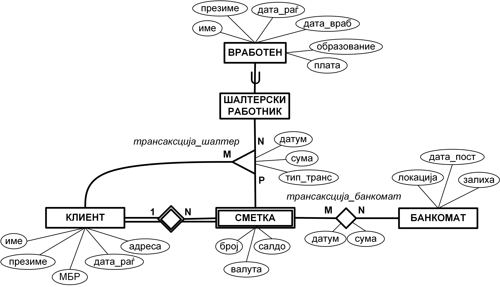

# Опис

На сликата подолу е прикажан дел од ЕР дијаграм за дел од работењето на една банка.

Во банката работат *вработени* за кои се чува  **име, презиме, дата на раѓање, дата на вработување, образование и плата**. Дел од вработените се **шалтерски работници** и истите се задолжени за извршување на трансакции на клиентите преку шалтер. Банката работи со повеќе клиенти при што за секој *клиент* се чува **име, презиме, матичен број, дата на раѓање и адреса.** Еден клиент може да има повеќе сметки во банката, при што за секоја *сметка* се чува број на **сметка, валута, салдо (изразено во соодветната валута) и информација за тоа на кој клиент е сметката**. Клиентите може да подигнуваат или уплатуваат пари на своите сметки преку шалтерите на банката. За секоја *трансакција* извршена <u>преку шалтер</u> се чува **датумот, подигнатата/уплатената сума, типот на трансакција (кој може да биде “уплата” или “исплата”), како и информации за тоа кој шалтерски работник ја извршил трансакцијата, од/на која сметка се подигнати/уплатени парите и кој е клиентот кој ја направил трансакцијата**. Банката на повеќе локации има поставено банкомати преку кои клиентите може да подигнат пари од своите сметки. За секој *банкомат* се чува **локацијата на која е поставен, датата на поставување, како и моменталната залиха со пари**. За секоја извршена *трансакција* <u>преку банкомат</u> се чува **на кој датум е извршена трансакцијата, колкава е подигнатата сума на пари, од која сметка се подигнати парите и преку кој банкомат**. При правење на трансакции на шалтер/банкомат подигнатата/уплатената сума е изразена во валутата со која работи сметката. Покрај сопственикот на сметката, трансакција на шалтер може да направи клиент кој е овластено лице на дадената сметка.

### Релационен модел

Vraboten(<u>ID</u>, ime, prezime, datum_r, datum_v, obrazovanie, plata)

Shalterski_rabotnik(<u>ID*</u>)

Klient(<u>MBR_k</u>, ime, prezime, adresa, datum)

Smetka(<u>MBR_k_s*</u>, <u>broj</u>, valuta, saldo)

Transakcija_shalter(<u>ID</u>, ID_v*, MBR_k*, MBR_k_s*, broj*, datum, suma, tip)

Bankomat(<u>ID</u>, lokacija, datum_p, zaliha)

Transakcija_bankomat(<u>ID</u>, MBR_k_s*, broj*, ID_b*, datum, suma).

| Табела | Primary key |
| -------- | -------- |
| Vraboten    | (ID)   |
| Shalterski_rabotnik    | (ID*) |
| Klient    | (MBR_k)   |
| Smetka    | (MBR_k_s*, broj) |
| Transakcija_shalter    | (ID)  |
| Bankomat    | (ID)  |
| Transakcija_bankomat    | (ID)  |

_Забелешка:_ Foreign key се означени со *

# Барања

1. Да се напишат соодветните DDL изрази за ентитетните множества „ТРАНСАКЦИЈА_ШАЛТЕР“, „ВРАБОТЕН“ и „ШАЛТЕРСКИ_РАБОТНИК“, како и за евентуалните релации кои произлегуваат од истите, доколку треба да бидат исполнети следните барања:

    - Доколку се избрише одреден вработен, информациите за извршените трансакции треба да останат зачувани во базата на податоци.

    - Датумот на извршување на трансакција не смее да биде во периодот од 30.12.2020 до 14.01.2021.

    - Типот на трансакцијата може да има една од двете вредности "uplata" или "isplata"

    - Датумот на раѓање на вработениот мора да биде пред неговиот датум на вработување

2. Да се напише DML израз со кој ќе се вратат имињата и презимињата на сите шалтерски работници кои имаат направено трансакција за исплата на средства во износ поголем од 1000 EUR од сметка која работи со валута EUR, подредени според името на шалтерските работници.

3. Да се напише DML израз со кој за секој шалтерски работник ќе се врати неговата шифра, датумот и бројот на трансакции за датумот на кој има направено најголем број на трансакции.

_Забелешка:_ Форматот на датум е 'YYYY-MM-DD'.

4. Во табелата **Klient** е креиран изведен атрибут **brSmetkiTransakcii** во кој е зачуван вкупниот број на различни сметки на кои дадениот клиент има направено трансакција преку шалтер. Дополнително, пресметана е моменталната вредност на овој атрибут за секој клиент. 
Да се напише соодветниот *тригер/и* за одржување на конзистентноста на атрибутот **brSmetkiTransakcii** при *додавање* или *ажурирање* на записите од кои зависи неговата вредност.