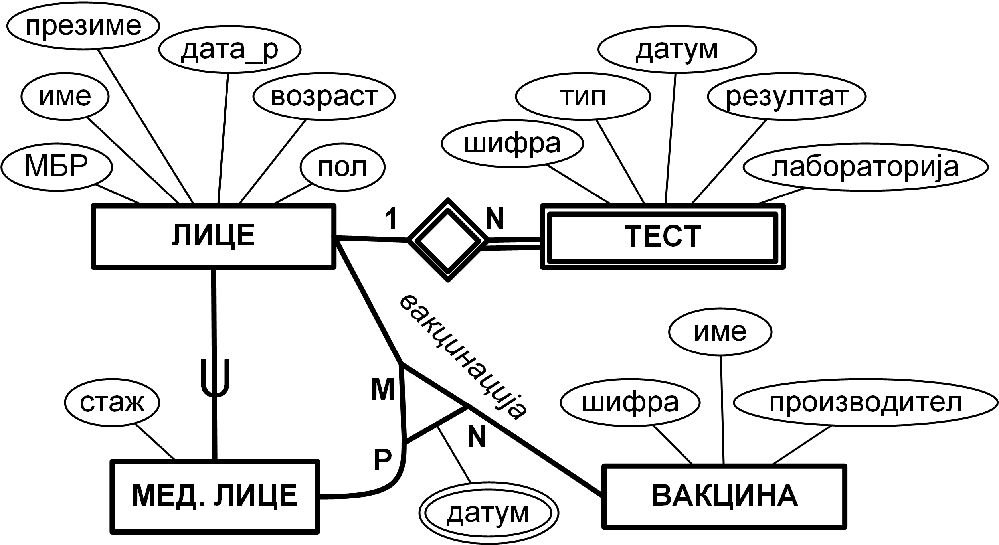

# Опис

На сликата подолу е прикажан дел од ЕР дијаграмот на база на податоци за водење евиденција за ковид-19.

### Релационен модел

Lice(<u>id</u>, mbr, ime, prezime, data_r, vozrast, pol)

Med_lice(<u>id*</u>, staz)

Test(<u>id*</u>, <u>shifra</u>, tip, datum, rezultat, laboratorija)

Vakcina(<u>shifra</u>, ime, proizvoditel)

Vakcinacija(<u>id_lice*</u>, <u>id_med_lice*</u>, <u>shifra_vakcina*</u>)

Vakcinacija_datum(<u>id_lice*</u>, <u>id_med_lice*</u>, <u>shifra_vakcina*</u>, <u>datum</u>)

# Барања

1. Да се напишат соодветните DDL изрази за ентитетните множества „ВАКЦИНАЦИЈА“ и „ТЕСТ“, како и за евентуалните релации кои произлегуваат од истите, доколку треба да бидат исполнети следните барања:

    - Mедицинските лица не може себеси да си даваат вакцина.

    - Лабораторијата „lab-abc“ прави само „seroloshki“ тестови.

    - Не сакаме да водиме информации за тестовите на лицата кои се избришани од базата на податоци.

2. Да се напише DML израз со кој ќе се вратат матичните броеви на лицата (сортирани во растечки редослед) кои биле позитивни и потоа примиле барем една доза вакцина.

3. Да се напише DML израз со кој ќе се врати информација за тоа колкав процент од лицата кои имале позитивен тест во август 2021 не биле целосно вакцинирани (вакцинирани со две дози вакцина).

_Забелешка:_ Форматот на датум е 'YYYY-MM-DD'.

4. Во табелата **Lice** е креиран изведен атрибут **celosno_imuniziran** кој прима вредности 0 и 1 и кажува дали лицето е целосно имунизирано (вакцинирано со барем две дози вакцина). Дополнително, пресметана е моменталната вредност на овој атрибут за секое лице.

Да се напише/ат *тригер/и* за одржување на вредноста на атрибутот **celosno_imuniziran** при *додавање* на записите од кои зависи неговата вредност.