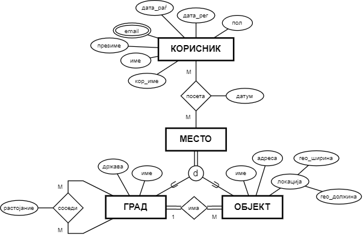

# Опис

На сликата подолу е прикажан дел од ЕР дијаграм за систем за планирање на патувања.

### Релационен модел

Korisnik(<u>kor_ime</u>, ime, prezime, pol, data_rag, data_reg)

Korisnik_email(<u>kor_ime*</u>, <u>email</u>)

Mesto(<u>id</u>, ime)

Poseta(<u>id</u>, kor_ime*, id_mesto*, datum)

Grad(<u>id_mesto*</u>, drzava)

Objekt(<u>id_mesto*</u>, adresa, geo_shirina, geo_dolzina, id_grad*)

Sosedi(<u>grad1*</u>, <u>grad2*</u>, rastojanie)

# Барања

1. Да се напишат соодветните DDL изрази за ентитетните множества „КОРИСНИК“ и „ПОСЕТА“, како и за евентуалните релации кои произлегуваат од истите, доколку треба да бидат исполнети следните барања:

    - Сакаме да водиме евиденција за посетите на местата од корисниците кои се избришани од системот.

    - Е-маил адресата завршува на „.com“ и истата треба да содржи најмалку 10 карактери.

    - Датумот на посета на место не смее да биде пo датумот на внесување на записот во базата.

2. Да се напише DML израз со кој ќе се вратат името и презимето на корисниците кои во ист ден посетиле објекти кои се наоѓаат во соседни градови. 

3. Да се напише DML израз со кој ќе се вратат името и презимето на корисниците кои посетиле објекти кои се наоѓаат во соседни градови чие растојание е помало од 300 km.

4. Да се напише DML израз со кој ќе се врати името на градот во кој се наоѓа објектот што бил посетен најголем број пати.

5. Да се напише DML израз со кој ќе се вртат имињата на објектите кои се наоѓаат во градот што бил посетен најголем број пати. За посети на градови се сметаат посетите на места што претставуваат градови. Во ова не се вклучени посетите на објекти во тие градови.

6. За секое место се чува изведен атрибут **broj_poseti** кој го означува бројот на различни корисници кои го посетиле.

Да се напише/ат соодветниот/те *тригер/и* за одржување на конзистентноста на атрибутот **broj_poseti** при додавање на записите од кои зависи нивната вредност.