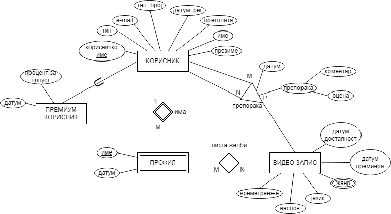

# Опис

На сликата подолу е прикажан дел од ЕР дијаграмот на база на податоци за сервис за стриминг на видео записи.

### Релационен модел

Korisnik(k_ime, ime, prezime, tip, pretplata, datum_reg, tel_broj, email)

Premium_korisnik(k_ime*, datum, procent_popust)

Profil(k_ime*, ime, datum)

Video_zapis(naslov, jazik, vremetraenje, datum_d, datum_p)

Video_zapis_zanr(naslov*, zanr)

Lista_zelbi(naslov*, k_ime*, ime*)

Preporaka(ID, k_ime_od*, k_ime_na*, naslov*, datum, komentar, ocena)

# Барања

1. Да се напишат соодветните DDL изрази за ентитетните множества „ВИДЕО ЗАПИС“ и „ПРЕПОРАКА“, како и за евентуалните релации кои произлегуваат од истите, доколку треба да бидат исполнети следните барања:

    - Сакаме да водиме евиденција за препорачаните видео записи од корисници кои се избришани од системот.

    - Корисникот не може себе да си препорача видео запис.

    - Датумот на препорака не може да биде во иднина (т.е. не смее да биде по тековниот датум).

2. Да се напишат соодветните DDL изрази за ентитетните множества „ЛИСТА_ЖЕЛБИ“, „КОРИСНИК“ и „ПРЕМИУМ_КОРИСНИК“, како и за евентуалните релации кои произлегуваат од истите, доколку треба да бидат исполнети следните барања:

    - Доколку не се внесе процентот на попуст за премиум корисник, тогаш сакаме да се додели предодредена вредност 10.

    - Сакаме да водиме евиденција во листите на желби за видео записите кои се избришани од системот.

    - Корисниците регистрирани пред 01.01.2015 не може да бидат претплатени на „pretplata 3“.

3. Да се напише DML израз со кој ќе се вратат имињата и презимињата на сите премиум корисници кои препорачале видео запис со времетраење подолго од 2 часа и за кој оставиле оцена поголема или еднаква на 4, подредени според датумот на регистрација во растечки редослед.

4. Да се напише DML израз со кој ќе се вратат корисничките имиња и насловите на препорачаните видео записи за сите премиум корисници кои добиле препорака со оцена поголема од 3 за барем еден видео запис во 2021 година кој е дел од листата на желби во барем еден од нивните профили, подредени според корисничкото име.

5. Да се напише DML израз со кој ќе се вратат корисничкото име и бројот на видео записи кои му биле препорачани на корисникот кој дал најголем број на препораки.

6. Да се напише DML израз со кој за секој корисник ќе се врати видео записот кој го препорачал најголем број пати.

7. Да се напише DML израз со кој за секој профил ќе се врати името на профилот и просечната оцена на видео записите во листата на желби асоцирана со тој профил. (Просечната оцена на секој видео запис се пресметува од сите оцени за тој видео запис).

8. За секој корисник се чува изведен атрибут **broj_preporaki** кој го означува вкупниот број на препораки (испратени и добиени) на видео записи за тој корисник. Дополнително, пресметана е моменталната вредност на овој атрибут за секој корисник.

Да се напише/ат соодветниот/те *тригер/и* за одржување на конзистентноста на атрибутот **broj_preporaki** при додавање на записите од кои зависи неговата вредност.

9. За секој видео запис се чува изведен атрибут **prosechna_ocena** кој ја означува просечната оцена добиена од препораки. Дополнително, пресметана е моменталната вредност на овој атрибут за секој видео запис.

Да се напише/ат соодветниот/те *тригер/и* за одржување на конзистентноста на атрибутот **prosechna_ocena** при додавање на записите од кои зависи неговата вредност.