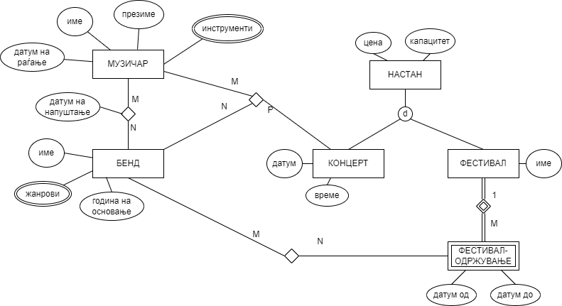

# Опис

На сликата подолу е прикажан дел од ЕР дијаграмот на база на податоци на систем за организација на музички фестивали и концерти.

### Релационен модел

Muzicar(id, ime, prezime, datum_ragjanje)

Muzicar_instrument(id_muzicar*, instrument)

Bend(id, ime, godina_osnovanje)

Bend_zanr(id_bend*, zanr)

Nastan(id, cena, kapacitet)

Koncert(id*, datum, vreme)

Festival(id*, ime)

Festival_odrzuvanje(id*, datum_od, datum_do)

Muzicar_bend(id_muzicar*, id_bend*, datum_napustanje)

Festival_bend(id_festival*, datum_od*, id_bend*)

Koncert_muzicar_bend(id_koncert*, id_muzicar*, id_bend*)

| Табела | Primary key |
| -------- | -------- |
| Muzicar    | (id)   |
| Muzicar_instrument    | (id_muzicar*, instrument)  |
| Bend    | (id)   |
| Bend_zanr    | (id_bend*, zanr)|
| Nastan    | (id)  |
| Koncert    | (id*)   |
| Festival    | (id*)   |
| Festival_odrzuvanje    | (id*, datum_od)    |
| Muzicar_bend   | (id_muzicar*, id_bend*)  |
| Festival_bend   | (id_festival*, datum_od*, id_bend*)  |
| Koncert_muzicar_bend    | (id_koncert*, id_muzicar*, id_bend*)   |

_Забелешка:_ Foreign key се означени со *

# Барања

1. Да се напишат соодветните DDL изрази за ентитетните множества „БЕНД“ и „ФЕСТИВАЛ_БЕНД“, како и за евентуалните релации кои произлегуваат од истите, доколку треба да бидат исполнети следните барања:

    - Бендот со шифра (id или id_bend) 5 не може да настапува на фестивалот со шифра (id_festival) 2.

    - Сакаме да водиме евиденција за настапите на фестивали за бендови што се бришат од системот.

    - Се чуваат податоци само за бендови кои се основани во 1970 или подоцна.

2. Да се напише DML израз со кој ќе се вратат имињата и презимињата на гитаристите (музичарите кои свират на инструментот гитара) кои настапиле на концерт заедно со бенд откако го напуштиле. Датумот на настап на музичарот заедно со бендот е датумот на самиот концерт. Резултатите треба да се подредени според името во растечки редослед. 

3. Да се напише DML израз со кој ќе се вратат сите парови на бендови (пар од имињата на бендовите) кои се основани во иста година. 

4. Да се напише DML израз со кој за секој фестивал ќе се врати името, цената на билетите, капацитетот на посетители, бројот на одржувања и вкупниот број на различни бендови кои настапиле. 

5. За секој музичар се чува изведен атрибут **br_bendovi** кој го означува бројот на бендови во кои свири тој музичар.
Да се напише/ат соодветниот/те *тригер/и* за одржување на конзистентноста на атрибутот **br_bendovi** при зачленување во бенд.
